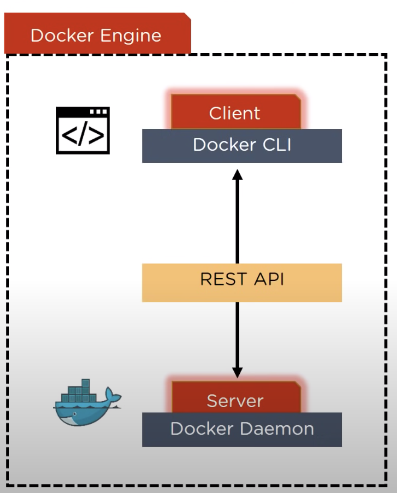
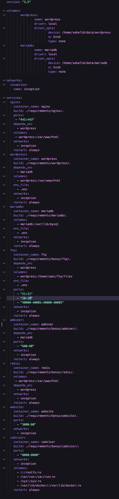

# Inception_42

This is complete guide of inception project  on this page you gonna learn what is docker container  and what used for and why we need it and also learn how to use docker images and also create your own docker image from scratch.

## What are Containers ?

Containers are an abstraction at the app layer that packages code and dependencies together. Multiple containers can run on the same machine and share the OS kernel with other containers, each running as isolated processes in user space. Containers take up less space than VMs (container images are typically tens of MBs in size), can handle more applications and require fewer VMs and Operating systems.

## What are Virtual Machines ?

Virtual machines (VMs) are an abstraction of physical hardware turning one server into many servers. The hypervisor allows multiple VMs to run on a single machine. Each VM includes a full copy of an operating system, the application, necessary binaries and libraries – taking up tens of GBs. VMs also slow to boot.

## Why Docker and What is the problem that is solving ?

- so let’s imagine a scenario pre docker era we have tester and developer and the developer

has just the code and its works perfectly fine on there system but when the tester take the code the test it in his machine its just doesn’t work and the reason could be a lot of thing it it might be the tester need some dependencies need to be installed in order for the code to work properly or some environnement variables needed to be added but they don’t exist it the tester machine. that means we found the problem how can we solve it ?

### Here When Docker Comes Into Place.

but you can be asking your self why not use virtual machine it might be good idea but it has alot of cons so let’s take look on differences between docker and VM’s

---

| Virtual Machine | Docker |
| --- | --- |
| Occupy a lot of memory space | Occupy a lot less memory space |
| long time to boot up | quick boot up because it uses the running kernel that you using |
| Difficult to scale up | super easy to scale |
| low efficiency | high efficiency |
| volumes storage cannot be shared across the VM’s  | volumes storage can be shared across the host and the containers |


- **Infrastructure** **:** it’s our computer components like our CPU and Hard Disk and other physical components.
- **Host Operating System :**  Its the OS that our computer is working on like linux or mac os or even windows
- **Docker engine :** this is where the magic happens docker engine is the base engine installed in the host machine to build and run containers using docker components and services, it uses
- **App :** is the container that is running in isolation on the other containers

# Let’s go deeper on how Docker Engine works in details.



The Docker engine is the core component of Docker. It is a lightweight runtime and packaging tool that bundles your application and its dependencies into a single package, called a container. The Docker engine includes the Docker daemon, which is a background process that manages Docker containers, and the Docker client, which is a command-line tool that allows you to interact with the Docker daemon.

Here's how the Docker engine works:

1. You write a Dockerfile, which is a text file that contains the instructions for building a Docker image. A Docker image is a lightweight, stand-alone, executable package that includes everything needed to run a piece of software, including the application code, libraries, dependencies, and runtime.
2. You use the Docker client to build the Docker image by running the **`docker build`** command and specifying the path to the Dockerfile. The Docker daemon reads the instructions in the Dockerfile and builds the image.
3. Once the image is built, you can use the Docker client to run the image as a container by using the **`docker run`** command. The Docker daemon creates a container from the image and runs the application inside the container.
4. The Docker engine provides a secure and isolated environment for the application to run in, and it also manages resources such as CPU, memory, and storage for the container.
5. You can use the Docker client to view, stop, and manage the containers running on your system. You can also use the Docker client to push the Docker image to a registry, such as Docker Hub, so that it can be shared with others.

# Now After we understand what is Docker and how it works now we gonna introduce you to the Dockerfile and Docker-compose file .

- A Dockerfile is a text file that contains the instructions for building a Docker image. It specifies the base image to use, the dependencies and software to install, and any other configurations or scripts that are needed to set up the environment for the application to run.

- A Docker Compose file is a YAML file that defines how multiple Docker containers should be set up and run. It allows you to define the services that make up your application, and then start and stop all of the containers with a single command.

Here are some key differences between a Dockerfile and a Docker Compose file:

1. Purpose: A Dockerfile is used to build a single Docker image, while a Docker Compose file is used to define and run multiple Docker containers as a single application.
2. Format: A Dockerfile is a plain text file with a specific format and syntax, while a Docker Compose file is written in YAML.
3. Scope: A Dockerfile is focused on building a single image, while a Docker Compose file is focused on defining and running multiple containers as a single application.
4. Commands: A Dockerfile uses specific commands, such as **`FROM`**, **`RUN`**, and **`CMD`**, to define the instructions for building the image. A Docker Compose file uses different commands, such as **`services`**, **`volumes`**, and **`networks`**, to define the containers and how they should be set up and run.

- Here is a brief explanation of some of the keys mentioned above.

1. **`FROM`**: This is a command that is used in a Dockerfile to specify the base image to use as the starting point for building the Docker image. The base image provides the foundational layers for the image, and you can then add additional layers on top of it to customize the image for your specific needs.
2. **`RUN`**: This is a command that is used in a Dockerfile to execute a command in the terminal of the container. It is typically used to install software or libraries that are needed by the application.
3. **`CMD`**: This is a command that is used in a Dockerfile to specify the default command that should be run when a container is started from the image. It is used to specify the main command that the container should run when it is started.
4. **`services`**: This is a key in a Docker Compose file that is used to define the services that make up your application. A service is a container that runs a specific application or component of your application.
5. **`volumes`**: This is a key in a Docker Compose file that is used to define the persistent storage for your application. A volume is a piece of storage that is attached to a container and is used to store data that should persist even when the container is stopped or removed.
6. **`networks`**: This is a key in a Docker Compose file that is used to define the networks that the containers should be connected to A network is a virtual network that is used to connect containers and allow them to communicate with each other.

## What are the most common commands are used in docker ?

1. **`docker build`**: Used to build a Docker image from a Dockerfile.
2. **`docker run`**: Used to run a Docker container based on a Docker image.
3. **`docker pull`**: Used to pull a Docker image from a registry, such as Docker Hub.
4. **`docker push`**: Used to push a Docker image to a registry.
5. **`docker ps`**: Used to list the running Docker containers on a system.
6. **`docker stop`**: Used to stop a running Docker container.
7. **`docker rm`**: Used to remove a Docker container.
8. **`docker rmi`**: Used to remove a Docker image.
9. **`docker exec`**: Used to execute a command in a running Docker container.
10. **`docker logs`**: Used to view the logs for a Docker container.

## DOCKER COMPOSE

Docker Compose is a tool for defining and running multi-container Docker applications. With Compose, you use a YAML file to configure your application's services. Then, using a single command, you can create and start all the services from your configuration.

Using Docker Compose can simplify the process of managing multi-container applications by allowing you to define all of your services in a single place and easily start and stop them. It also makes it easy to scale your application by allowing you to increase or decrease the number of replicas of a service.

## Here is a simple example of a Docker Compose file



## What are the most common commands are used in docker-compose ?

- **`up`**: Create and start containers
- **`down`**: Stop and remove containers, networks, images, and volumes
- **`start`**: Start existing containers
- **`stop`**: Stop running containers
- **`restart`**: Restart running containers
- **`build`**: Build images
- **`ps`**: List containers
- **`logs`**: View output from containers
- **`exec`**: Run a command in a running container
- **`pull`**: Pull images from a registry
- **`push`**: Push images to a registry

## What are DOCKER NETWORKS

In Docker, a network is a virtual software defined network that connects Docker containers. It allows containers to communicate with each other and the outside world, and it provides an additional layer of abstraction over the underlying network infrastructure.

There are several types of networks that you can create in Docker, including:

- Bridge: A bridge network is the default network type when you install Docker. It allows containers to communicate with each other and the host machine, but provides no access to the outside world.
- Host: A host network uses the host machine's network stack and provides no isolation between the host and the container.
- Overlay: An overlay network allows containers running on different Docker hosts to communicate with each other.
- Macvlan: A Macvlan network allows a container to have its own IP address on the same subnet as the host machine.

You can create and manage networks using the **`docker network`** command. For example, to create a new bridge network, you can use the following command:

`docker network create my-network`

- ressources for docker network : [https://www.youtube.com/watch?v=bKFMS5C4CG0](https://www.youtube.com/watch?v=bKFMS5C4CG0)

## What are DOCKER VOLUMES

In Docker, a volume is a persistent storage location that is used to store data from a container. Volumes are used to persist data from a container even after the container is deleted, and they can be shared between containers.

There are two types of volumes in Docker:

- Bind mount: A bind mount is a file or directory on the host machine that is mounted into a container. Any changes made to the bind mount are reflected on the host machine and in any other containers that mount the same file or directory.
- Named volume: A named volume is a managed volume that is created and managed by Docker. It is stored in a specific location on the host machine, and it is not tied to a specific file or directory on the host. Named volumes are useful for storing data that needs to be shared between containers, as they can be easily attached and detached from containers.

You can create and manage volumes using the **`docker volume`** command. For example, to create a new named volume, you can use the following command:

```bash
docker volume create my-volume
```

To mount a volume into a container, you can use the **`-v`** flag when starting the container. For example:

```bash
docker run -v my-volume:/var/lib/mysql mysql
```

This command will start a container running the **`mysql`** image and mount the **`my-volume`** volume at **`/var/lib/mysql`** in the container. Any data written to this location in the container will be persisted in the volume, even if the container is deleted.

You can also use Docker Compose to create and manage volumes. In a Compose file, you can define a volume and attach it to a service. For example:

```yaml
version: '3'
services:
  db:
    image: mysql
    volumes:
      - db-data:/var/lib/mysql
volumes:
  db-data:

```

This Compose file defines a **`db-data`** volume and attaches it to the **`db`** service at **`/var/lib/mysql`**. Any data written to this location in the container will be persisted in the volume.

# MANDATORY PART

## **Mariadb**

MariaDB is a free and open-source relational database management system (RDBMS) that is widely used as a drop-in replacement for MySQL. It is named after the developer's daughter, Maria, and is designed to be a community-driven alternative to MySQL, with a focus on simplicity, collaboration, and compatibility with other database systems.

MariaDB includes a number of additional features and improvements over MySQL, including better performance, enhanced security, and support for new storage engines and data types. It is also actively developed and supported by a large and active community of users and developers.

- Installation part:

1.  Pull `debian:buster`  (our base image)
2. update our package manager `apt-get update -y`
3. install mariadb server `apt-get install mariadb-server -y`
4. go to /etc/mysql/mariadb.conf.d/50-server.cnf  and change line 28 from `bind-address = 127.0.0.1`  to  `bind-address = 0.0.0.0`  for any network can connect to our Mariadb 
5. `service mysql start` 
6. create our database and our user and give him the access to the database then FLUSH PRIVILEGES 
- scripts part:

```bash

#db_name = Database Name
#db_user = User
#db_pwd = User Password

echo "CREATE DATABASE IF NOT EXISTS $db_name ;" > db1.sql
echo "CREATE USER IF NOT EXISTS '$db_user'@'%' IDENTIFIED BY '$db_pwd' ;" >> db1.sql
echo "GRANT ALL PRIVILEGES ON $db_name.* TO '$db_user'@'%' ;" >> db1.sql
echo "ALTER USER 'root'@'localhost' IDENTIFIED BY '12345' ;" >> db1.sql
echo "FLUSH PRIVILEGES;" >> db1.sql

mysql < db1.sql
```

to keep the container running run this command in CMD in your Dockerfile  `/usr/bin/mysqld_safe`

`mysqld_safe` is typically used to start the MySQL server when the system is booting, and it is also used to start and stop the MySQL server manually

---

---

# Wordpress

WordPress is a content management system (CMS) based on PHP and MySQL. It is an open-source platform that is widely used for building websites, blogs, and applications. With WordPress, users can easily create and manage their own websites without the need for advanced technical skills. It is known for its simplicity and flexibility, making it a popular choice for both beginners and experienced developers. WordPress has a large community of users and developers who contribute to the platform, which has led to the development of a wide range of themes, plugins, and other tools that can be used to extend the functionality of WordPress websites.

- **Before We dive into Installation part you need to know about fastCGI because it pretty importing in our case.**

## FastCGI

FastCGI (Fast Common Gateway Interface) is a protocol that allows web servers to communicate with web applications, such as PHP scripts. It is designed to allow web servers to execute scripts in a more efficient way than traditional CGI (Common Gateway Interface) protocols, which involve starting a new process to execute each script.

PHP-FPM (FastCGI Process Manager) is an implementation of the FastCGI protocol specifically designed for use with PHP. It works by starting a pool of worker processes that are responsible for executing PHP scripts. When a web server receives a request for a PHP script, it passes the request to one of the worker processes, which then executes the script and returns the result to the web server. This allows PHP scripts to be executed more efficiently, as the worker processes can be reused for multiple requests.

PHP-FPM is often used as an alternative to mod_php, which is an Apache module that embeds the PHP interpreter directly into the Apache web server. Using PHP-FPM can improve the performance and scalability of PHP scripts, as it allows the web server and PHP to run in separate processes. It also allows for more fine-grained control over the PHP environment, as different pools of worker processes can be configured with different settings.

- Installation part:

1. pull `debian:buster`  (our base image)
2. update our package manager `apt-get -y update` && `apt-get -y upgrade` && `apt update -y` && `apt upgrade -y`
3. `apt install` `php-fpm` `php-mysql -y`&& `apt install curl -y`

The first command installs the **`php-fpm`** and **`php-mysql`** packages. **`php-fpm`** (FastCGI Process Manager) is an implementation of FastCGI that is used to execute PHP scripts, and **`php-mysql`** is a PHP extension that allows PHP to communicate with MySQL databases.

The third command installs the **`curl`** package, which is a command-line tool for transferring data using various network protocols, including HTTP, HTTPS, and FTP.

My source source of info [`https://developer.wordpress.org/cli/commands/core/`](https://developer.wordpress.org/cli/commands/core/)

- script part:

```bash
#!/bin/bash

# create directory to use in nginx container later and also to setup the wordpress conf
mkdir /var/www/
mkdir /var/www/html

cd /var/www/html

# remove all the wordpress files if there is something from the volumes to install it again
rm -rf *

# The commands are for installing and using the WP-CLI tool.

# downloads the WP-CLI PHAR (PHP Archive) file from the GitHub repository. The -O flag tells curl to save the file with the same name as it has on the server.
curl -O https://raw.githubusercontent.com/wp-cli/builds/gh-pages/phar/wp-cli.phar 

# makes the WP-CLI PHAR file executable.
chmod +x wp-cli.phar 

# moves the WP-CLI PHAR file to the /usr/local/bin directory, which is in the system's PATH, and renames it to wp. This allows you to run the wp command from any directory
mv wp-cli.phar /usr/local/bin/wp

# downloads the latest version of WordPress to the current directory. The --allow-root flag allows the command to be run as the root user, which is necessary if you are logged in as the root user or if you are using WP-CLI with a system-level installation of WordPress.
wp core download --allow-root

mv /var/www/html/wp-config-sample.php /var/www/html/wp-config.php

# change the those lines in wp-config.php file to connect with database

#line 23
sed -i -r "s/database/$db_name/1"   wp-config.php
#line 26
sed -i -r "s/database_user/$db_user/1"  wp-config.php
#line 29
sed -i -r "s/passwod/$db_pwd/1"    wp-config.php

#line 32
sed -i -r "s/localhost/mariadb/1"    wp-config.php  (to connect with mariadb database)

# installs WordPress and sets up the basic configuration for the site. The --url option specifies the URL of the site, --title sets the site's title, --admin_user and --admin_password set the username and password for the site's administrator account, and --admin_email sets the email address for the administrator. The --skip-email flag prevents WP-CLI from sending an email to the administrator with the login details.
wp core install --url=$DOMAIN_NAME/ --title=$WP_TITLE --admin_user=$WP_ADMIN_USR --admin_password=$WP_ADMIN_PWD --admin_email=$WP_ADMIN_EMAIL --skip-email --allow-root

# creates a new user account with the specified username, email address, and password. The --role option sets the user's role to author, which gives the user the ability to publish and manage their own posts.
wp user create $WP_USR $WP_EMAIL --role=author --user_pass=$WP_PWD --allow-root

# installs the Astra theme and activates it for the site. The --activate flag tells WP-CLI to make the theme the active theme for the site.
wp theme install astra --activate --allow-root


wp plugin install redis-cache --activate --allow-root


# uses the sed command to modify the www.conf file in the /etc/php/7.3/fpm/pool.d directory. The s/listen = \/run\/php\/php7.3-fpm.sock/listen = 9000/g command substitutes the value 9000 for /run/php/php7.3-fpm.sock throughout the file. This changes the socket that PHP-FPM listens on from a Unix domain socket to a TCP port.
sed -i 's/listen = \/run\/php\/php7.3-fpm.sock/listen = 9000/g' /etc/php/7.3/fpm/pool.d/www.conf

# creates the /run/php directory, which is used by PHP-FPM to store Unix domain sockets.
mkdir /run/php


wp redis enable --allow-root


# starts the PHP-FPM service in the foreground. The -F flag tells PHP-FPM to run in the foreground, rather than as a daemon in the background.
/usr/sbin/php-fpm7.3 -F
```

---

---

# Nginx

NGINX is a web server that can also be used as a reverse proxy, load balancer, and HTTP cache. It is known for its high performance, stability, and low resource consumption. NGINX is often used to handle server-side requests for web applications, and it can also be used to serve static content such as images and JavaScript files. In addition to its web server capabilities, NGINX can be configured to handle other types of network protocols, such as Secure Sockets Layer (SSL) and Transport Layer Security (TLS). It is often used in conjunction with other software, such as databases and content management systems, to build robust and scalable web applications.

- **Before We dive into Installation part you need to know about TLSv1.2 or TLSv1.3 because it pretty importing in our case.**

### TLS (Transport Layer Security)

Transport Layer Security (TLS) is a security protocol that is used to establish secure communication between two parties over the internet. It is designed to prevent eavesdropping, tampering, and message forgery, and to provide authenticity and integrity for transmitted data. TLS is used to secure a wide range of internet-based applications, including web browsing, email, file transfer, virtual private networks (VPNs), and real-time communication systems.

TLS works by using public key encryption to establish a secure connection between two parties. When a client wants to communicate with a server using TLS, the client and server exchange a series of messages to establish a secure connection. This process includes the exchange of digital certificates and the negotiation of encryption keys. Once the connection is established, the client and server can communicate securely over the internet.

TLS is the successor to the Secure Sockets Layer (SSL) protocol, which was developed in the 1990s. TLS is based on SSL, but it has been updated to address a number of security vulnerabilities that were discovered in SSL. TLS is now the de facto standard for secure communication on the internet, and it is used by millions of websites and applications to protect sensitive data.

### OpenSSL

OpenSSL is an open-source implementation of the Secure Sockets Layer (SSL) and Transport Layer Security (TLS) protocols. It is a widely used tool for working with SSL and TLS, and it is available for most operating systems.

OpenSSL can be used for a variety of tasks related to SSL and TLS, including:

- Creating and managing SSL/TLS certificates and private keys
- Setting up and configuring SSL/TLS-enabled servers
- Connecting to SSL/TLS-enabled servers as a client
- Debugging SSL/TLS connections
- Generating and signing digital certificates

OpenSSL is often used by system administrators and developers to secure communication between servers and clients, or to create secure tunnels for transmitting data over the internet. It is also used to create secure and encrypted connections for email, file transfer, and other types of internet communication.

- Installation part:

1. pull `debian:buster`  (our base image)
2. update our package manager  `apt update -y` && `apt upgrade -y`
3. `apt install -y nginx` && `apt install openssl -y` will install the NGINX web server and the OpenSSL tool.
4. `openssl req -x509 -nodes -days 365 -newkey rsa:2048 -keyout /etc/ssl/private/nginx-selfsigned.key -out /etc/ssl/certs/nginx-selfsigned.crt -subj "/C=MO/L=KH/O=1337/OU=student/CN=[sahafid.1337.ma](http://sahafid.42.ma/)"`

This command generates a self-signed SSL/TLS certificate and private key using OpenSSL.

The **`req`** command is used to generate a certificate signing request (CSR) or a self-signed certificate. The **`-x509`** option tells OpenSSL to generate a self-signed certificate instead of a CSR.

The **`-nodes`** option tells OpenSSL not to encrypt the private key with a passphrase. This means that the private key will not be protected by a password, and it will be stored in plaintext. This is generally not recommended for production environments, as it can make the key more vulnerable to unauthorized access.

The **`-days`** option specifies the number of days that the certificate should be valid for. In this case, the certificate will be valid for 365 days (one year).

The **`-newkey`** option specifies that a new private key should be generated. The **`rsa:2048`** argument tells OpenSSL to generate an RSA key with a length of 2048 bits.

The **`-keyout`** option specifies the file where the private key should be stored, and the **`-out`** option specifies the file where the certificate should be stored.

The **`-subj`** option specifies the subject of the certificate. The subject includes information about the organization that the certificate will be used for, as well as information about the server where the certificate will be installed. In this case, the subject includes the country (C=MO), the location (L=KH), the organization (O=1337), the organizational unit (OU=student), and the common name (CN=sahafid.42.ma).

After running this command, a self-signed SSL/TLS certificate and private key will be generated and stored in the specified files. You can then use these files to configure an NGINX server to use SSL/TLS encryption. Keep in mind that self-signed certificates are not trusted by most web browsers, so you will typically need to obtain a certificate from a trusted certificate authority (CA) for use in a production environment.

```bash
server {

# The server listens for incoming connections on port 443, which is the default port for HTTPS traffic. The server listens for both IPv4 and IPv6 connections
	listen 443 ssl;
	listen [::]:443 ssl;

# replace login with your own loggin
	server_name www.login.42.fr login.42.fr;

# The ssl_certificate and ssl_certificate_key directives specify the locations of the SSL/TLS certificate and private key, respectively, that will be used to encrypt the traffic. The ssl_protocols directive specifies the TLS protocols that the server should support.
	ssl_certificate /etc/ssl/certs/nginx-selfsigned.crt;
	ssl_certificate_key /etc/ssl/private/nginx-selfsigned.key;

# We are using version 1.3 of TLS
	ssl_protocols TLSv1.3;

# The index directive specifies the default file that should be served when a client requests a directory on the server. The root directive specifies the root directory that should be used to search for files.
	index index.php;
	root /var/www/html;

# The location directive defines a block of configuration that applies to a specific location, which is specified using a regular expression. In this case, the regular expression ~ [^/]\\.php(/|$) matches any request that ends in .php and is not preceded by a / character.

	location ~ [^/]\\.php(/|$) {

# The try_files directive attempts to serve the requested file, and if it does not exist, it will return a 404 error.
        try_files $uri =404;

#The fastcgi_pass directive passes the request to a FastCGI server for processing.
        fastcgi_pass wordpress:9000;

	# The include directive includes a file with FastCGI parameters.
        include fastcgi_params;

#The fastcgi_param directive sets a FastCGI parameter. The SCRIPT_FILENAME parameter specifies the path to the PHP script that should be executed.
        fastcgi_param SCRIPT_FILENAME $document_root$fastcgi_script_name;
    }

}
```

### the clean version 🙂

```bash
server {
	listen 443 ssl;
	listen [::]:443 ssl;

	server_name www.login.1337.ma login.1337.ma;

	ssl_certificate /etc/ssl/certs/nginx-selfsigned.crt;
	ssl_certificate_key /etc/ssl/private/nginx-selfsigned.key;

	ssl_protocols TLSv1.3;

	index index.php;
	root /var/www/html;

	location ~ [^/]\\.php(/|$) {
        try_files $uri =404;
        fastcgi_pass wordpress:9000;
        include fastcgi_params;
        fastcgi_param SCRIPT_FILENAME $document_root$fastcgi_script_name;
    }
}
```

you gonna copy this configuration into this file `/etc/nginx/sites-available/default`

to keep the container running you should use this command `nginx -g daemon off;`

The **`nginx -g daemon off;`** command is used to start the Nginx web server in the foreground and to disable daemon mode.

In Nginx, the **`daemon`** directive is used to enable or disable daemon mode, which determines how the Nginx process is run. When daemon mode is enabled, the Nginx process runs in the background and detaches from the terminal. When daemon mode is disabled, the Nginx process runs in the foreground and stays connected to the terminal.

# BONUS PART

## Adminer

Adminer is a tool for managing database systems. It is a single PHP file that provides a user-friendly interface for working with databases. With Adminer, you can create and drop databases, create, copy, alter, and drop tables, delete, edit, and add fields, execute any SQL command, and manage users and permissions. Adminer supports a wide range of database systems, including MySQL, MariaDB, PostgreSQL, SQLite, Oracle, and MS SQL. It is open source software that can be used on any server with PHP installed.

- Installation part:

1. pull `debian:buster`  (our base image)
2. update our package manager  `apt update -y` 
3. `apt install wget -y` && `apt-get install php php-mysql -y`

- The **`wget`** package is a utility for downloading files from the internet.
- PHP is a programming language that is often used to develop dynamic web applications. The PHP MySQL module allows PHP to communicate with MySQL databases.
After running this command, you will have the necessary software installed to run a PHP web application that interacts with a MySQL database.

## FTP (File Transfert Protocol)

File Transfer Protocol (FTP) is a standard network protocol used to transfer files from one host to another over a TCP-based network, such as the internet. FTP is built on a client-server architecture and uses separate control and data connections between the client and the server.

The FTP protocol enables clients to upload and download files, create and delete directories, and list the contents of directories on a remote server. FTP clients are available for all major operating systems, and most modern web browsers also support FTP.

### Difference between active and passive mode Connections

In FTP, there are two modes of data transfer: active and passive. In active mode, the client initiates a connection to the server to transfer data. In passive mode, the client initiates a connection to the server to request a data transfer, and the server then initiates a connection back to the client to send the data.

Passive mode is often used when the client is behind a firewall or NAT (Network Address Translation) device, because the client's firewall or NAT may block incoming connections from the server. Passive mode allows the client to establish the connection with the server, and then the server can establish a connection back to the client to send data.

- Installation part:

1. pull `debian:buster`  (our base image)
2. update our package manager  `apt update -y` 
3. `apt install vsftpd -y`

**`vsftpd`** package on your system. **`vsftpd`**
 stands for "Very Secure FTP Daemon," and it is a popular FTP server software for Unix-like systems. Once installed, you can use **`vsftpd`** to set up and manage an FTP server on your system.

- script part:

```bash
#!/bin/bash

service vsftpd start

# Add the USER, change his password and declare him as the owner of wordpress folder and all subfolders

adduser $ftp_user --disabled-password

echo "$ftp_user:$ftp_pwd" | /usr/sbin/chpasswd &> /dev/null

echo "$ftp_user" | tee -a /etc/vsftpd.userlist &> /dev/null

mkdir /home/$ftp_user/ftp

chown nobody:nogroup /home/$ftp_user/ftp
chmod a-w /home/$ftp_user/ftp

mkdir /home/$ftp_user/ftp/files
chown $ftp_user:$ftp_user /home/$ftp_user/ftp/files

sed -i -r "s/#write_enable=YES/write_enable=YES/1"   /etc/vsftpd.conf
sed -i -r "s/#chroot_local_user=YES/chroot_local_user=YES/1"   /etc/vsftpd.conf

echo "
local_enable=YES
allow_writeable_chroot=YES
pasv_enable=YES
local_root=/home/sami/ftp
pasv_min_port=40000
pasv_max_port=40005
userlist_file=/etc/vsftpd.userlist" >> /etc/vsftpd.conf

service vsftpd stop

/usr/sbin/vsftpd
```

1. The script starts the **`vsftpd`** service using the **`service`** command.
2. It adds a new user using the **`adduser`** command, with the username specified by the **`$ftp_user`** variable. The **`-disabled-password`** flag specifies that the user should not be able to log in using a password.
3. The script then sets the password for the user to the value specified by the **`$ftp_pwd`** variable.
4. It adds the new user's username to the **`/etc/vsftpd.userlist`** file, which is used by **`vsftpd`** to specify which users are allowed to log in to the FTP server.
5. The script creates a new directory at **`/home/$ftp_user/ftp`** and sets the owner to **`nobody:nogroup`**. It then sets the permissions on this directory so that it is not writable.
6. The script creates another directory at **`/home/$ftp_user/ftp/files`** and sets the owner to **`$ftp_user:$ftp_user`**.
7. It modifies the **`/etc/vsftpd.conf`** file to enable writing and chroot (i.e., jailing) for local users, and to enable passive mode and specify the range of ports to use for passive mode connections.
8. **`local_enable=YES`**: This directive tells **`vsftpd`** to allow local users to log in to the FTP server.
9. **`allow_writeable_chroot=YES`**: This directive tells **`vsftpd`** to allow local users to have write access to their home directories.
10. **`pasv_enable=YES`**: This directive tells **`vsftpd`** to allow passive mode connections.
11. **`local_root=/home/sami/ftp`**: This directive specifies the root directory for local users. All local users will be jailed (i.e., restricted) to this directory and its subdirectories.
12. **`pasv_min_port`** and **`pasv_max_port`**: These directives specify the range of ports that the server can use to establish a connection back to the client when in passive mode.
13. **`userlist_file=/etc/vsftpd.userlist`**: This directive specifies the file that contains the list of users who are allowed to log in to the FTP serve
8. The script stops the **`vsftpd`** service and starts it again using the **`/usr/sbin/vsftpd`** command.

## REDIS cache

Redis is an in-memory data structure store that can be used as a database, cache, and message broker. It supports a variety of data structures such as strings, hashes, lists, sets, and more. One of the main features of Redis is its ability to cache data in memory, which allows it to achieve very fast read and write speeds. Redis can be used to improve the performance of web applications by reducing the time it takes to access data from a database or other slow storage layer. In addition to its caching capabilities, Redis also offers publish/subscribe messaging, transactions, and support for multiple data structures, making it a versatile tool for a variety of use cases.

- Installation part:

1. pull `debian:buster`  (our base image)
2. update our package manager  `apt update -y` 
3. 

```bash
echo "maxmemory 256mb" >> /etc/redis/redis.conf
echo "maxmemory-policy allkeys-lru" >> /etc/redis/redis.conf
sed -i -r "s/bind 127.0.0.1/#bind 127.0.0.0/" /etc/redis/redis.conf
```

These commands will install the Redis server on your system and configure it to use a maximum of 256MB of memory. The "maxmemory" directive sets the maximum amount of memory that Redis is allowed to use. The "maxmemory-policy" directive specifies the policy that Redis should use when the maximum memory limit has been reached. In this case, the "allkeys-lru" policy will cause Redis to remove the least recently used keys in order to free up memory.

It's important to carefully set the maximum memory limit for your Redis instance, as using too much memory can cause performance issues or even crash the system. You should also consider the type of workload that your Redis instance will be handling, as different workloads may have different memory requirements.

for the last command This command modifies the **`redis.conf`** configuration file and comments out the **`bind`** directive, which specifies the IP address that the Redis server should listen on. By commenting out this directive, the Redis server will listen on all available network interfaces.

to keep the redis  `CMD ["redis-server", "--protected-mode", "no"]`

The **`redis-server`** command is used to start the Redis server, which is a persistent key-value store that can be used to store data structures such as strings, hashes, lists, and sets.

The **`--protected-mode`** option specifies whether the Redis server should run in protected mode or not. Protected mode is a security feature that was introduced in Redis version 4.0. It prevents the Redis server from accepting connections from clients that are not running on the same host as the server.

By specifying the **`no`** argument, the **`--protected-mode`** option disables protected mode and allows the Redis server to accept connections from clients running on any host.


and add these line to wp-config.php 


define( 'WP_REDIS_HOST', 'redis' );
define( 'WP_REDIS_PORT', 6379 );
define('WP_CACHE', true);


## CADVISOR (Extra service)

cAdvisor (short for Container Advisor) is an open-source tool developed by Google for monitoring and analyzing resource usage and performance of containers. It provides information about the resource usage of individual containers, as well as the resource usage of the host machine itself.

cAdvisor runs as a daemon on the host machine and collects resource usage and performance data from the operating system and individual containers. It exposes this data through a web-based interface and a set of RESTful APIs, allowing you to monitor and analyze the resource usage of your containers in real-time.

cAdvisor is particularly useful for monitoring and optimizing the performance of containerized applications in a production environment. It can help you identify resource constraints, troubleshoot issues, and optimize resource allocation to improve the performance of your containers.

- Installation part:
1. pull `debian:buster`  (our base image)
2. update our package manager  `apt update -y` 
3. `apt install wget -y` (**`wget`** package, which is a utility for downloading files from the web.)
4. `wget [https://github.com/google/cadvisor/releases/download/v0.37.0/cadvisor](https://github.com/google/cadvisor/releases/download/v0.37.0/cadvisor)` (download cadvisor from gihub)
5. `chmod +x cadvisor` change permission to executable
6. last but not least run the executable `./cadvisor` and you can find the stats in the website.

note:

make sure to expose port 8080 in docker-compose file and also connect the right volumes you can see how on the docker-compose file up  ☝️
